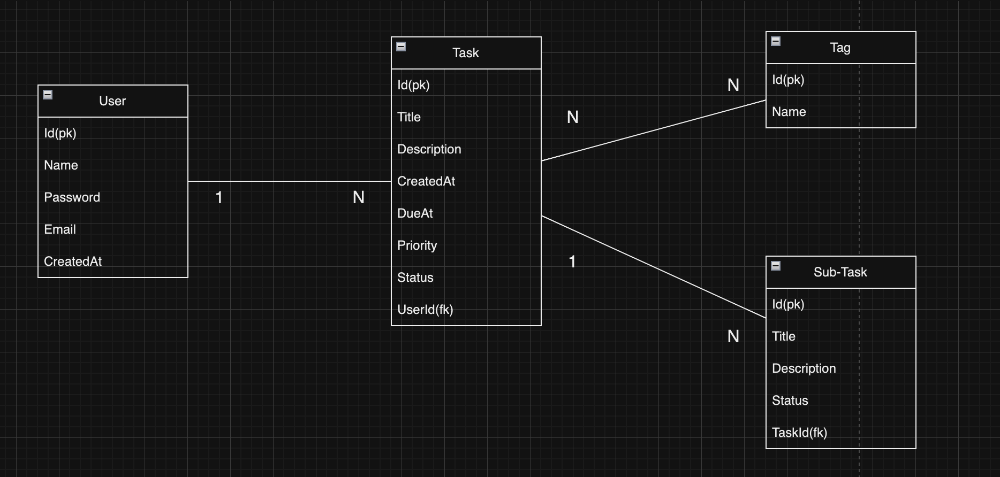

# Task Manager API

## 1. Introduction
Task Manager API is a work-in-progress ASP.NET Core API for managing Tasks, Sub-Tasks, and Tags. It aims to provide users with efficient task management capabilities, leveraging the MVC architecture and SQL database for data storage.
## 2. Features (To be Implemented)
- **User Management:** Users can register, login, and manage their accounts. **(To be Implemented)**
- **Task Management:** Users can create, view, edit, and delete tasks.
- **Sub-task Management:** Users can add and manage sub-tasks for tasks, including updating their status.
- **Tag Management:** Users can add tags to tasks and filter tasks based on tags.

## 3. Database Structure
<div style="display: flex; justify-content: center;">
    
</div>

## 4. How to use / Endpoints
```bash
# Clone the project
git clone https://github.com/BomingYu/TaskManager.git

# Enter the project
cd api

# Start the project in Swagger
dotnet watch run
```
Run the application using the following command to view all endpoints.

## 5. Technology

- ASP.NET Core
- Entity Framework Core
- SQL Server
